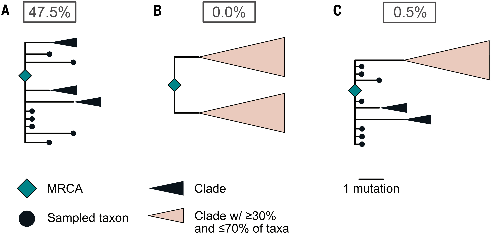

The Bayes factors are further inflated by another error in the code.

The analysis uses a stable coalescence that is defined in the [Supplementary Material](https://www.science.org/doi/suppl/10.1126/science.abp8337/suppl_file/science.abp8337_sm.v2.pdf) as a tMRCA that ignores basal lineages that do not survive the sampling period. An error in the implementation (`coalescent_timing` in [stableCoalescence_cladeAnalysis.py](https://github.com/sars-cov-2-origins/multi-introduction/blob/78ec9e3b90215267b45ed34be2720566b7398b77/FAVITES-COVID-Lite/scripts/stableCoalescence_cladeAnalysis.py)) causes the analysis to ignore basal lineages that do survive the sampling period.

For the primary analysis, correcting this error shifts 13% of the tMRCAs back in time by an average of 5.5 days, and reduces the Bayes factors to 3. 9 and 4.0. 

# Explanation

The stable coalescence was introduced in [Timing the SARS-CoV-2 index case in Hubei province](https://www.science.org/doi/10.1126/science.abf8003), where tMRCAs inferred from observations were used in conjunction with tMRCAs from simulations. It was noted that "coalescent processes can prune basal viral lineages before they have the opportunity to be sampled, potentially pushing SARS-CoV-2 tMRCA estimates forward in time". As a result, the tMRCAs inferred from observations do not account for basal lineages that went extinct before they could be sampled. The stable coalescence is essentially a tMRCA that reproduces a similar effect in the simulations, so that the tMRCAs from the simulations ignore basal lineages that went extinct before the end of the sampling period. The effect is shown in [Fig. 2](https://www.science.org/cms/10.1126/science.abf8003/asset/7e12255a-8ddf-4d55-bc59-6644bc8de6e6/assets/graphic/372_412_f2.jpeg) of that paper, reproduced below.


In the present analysis, the sampling period extends from the time of the first hospitalization until the fifty-thousandth infection, as described on page 8 of the [Supplementary Material](https://www.science.org/doi/suppl/10.1126/science.abp8337/suppl_file/science.abp8337_sm.v2.pdf).


Accordingly, the stable coalescence is the tMRCA of sampled infections that are active on the day of the fifty-thousandth infection or, should the epidemic fail to grow so far, the end of the simulation, as described on page 10 of the [Supplementary Material](https://www.science.org/doi/suppl/10.1126/science.abp8337/suppl_file/science.abp8337_sm.v2.pdf).  


This prunes largerfails to implement the stable coalescent correctly. As a result, basal lineages that do survive the sampling period are ignored as well.

in the code  . A mistake in the implementation negcauses basal lineages that do survive the sampling period to be ignored as well.

The function `calculate_bf` takes an array of values as `simulation_results` and divides them by their sum to produce `pr_3_topos` - an array of probabilities for three topologies:
```python
def calculate_bf(asr_results, simulation_results):
...
# FAVITES simulation information
# the 3 trees are in the order (t_p, t_1C, t_2C)
pr_3_topos = np.array(simulation_results)/sum(simulation_results)
```
This would be an appropriate way to compute the probabilities for the three topologies, were the values the numbers of simulations conforming to the three topologies and their sum equal to the total number of simulations.

Unfortunately, the values are in fact the probabilities for the three topologies, already computed in `clade_analysis_update` (note that the total number of simulations was 1100):
```
polytomy_result = count_atLeastMinDescendants/1100
…
cc_result = cc_count_30perc_twoPolytomies/1100
ab_result = ab_count_30perc_twoPolytomies/1100
…
simulation_results = [polytomy_result, ab_result, cc_result]
…
bf_unconstrained = calculate_bf(unconstrained_results, simulation_results)
bf_recCA = calculate_bf(recCA_results, simulation_results)
```
The sum of these probabilities is significantly less than one, because many simulations do not conform to any of the three topologies. For the main analysis prior to the bugfix in #1, the sum of the probabilities (shown in Figure 2) was 0.475 + 0.005 + 0 = 0.48. (Note that the values [t_p, t_1C, t_2C] in the array `simulation_results` are, respectively, the probabilities for the topologies A, C and B in Figure 2):



By dividing these probabilities by their sum, `calculate_bf` increases them according to the proportion of simulations that do not have a topology in this subset. This increase is applied twice in the probabilities for the multiple introductions, because they are based on the single introduction probabilities squared. For example, in the main analysis the probabilities for the single introduction double from [0.475, 0.03, 0] to [0.94, 0.06, 0], while the most significant probability for the multiple introductions quadruples from [0.226] to [0.885]. The net result is doubling of the Bayes factors.

This is obviously wrong. The correct calculation, as described on page 13 of the supplementary materials, does not include this increase. 


This mistake might have been caused by miscommunication between the programmers of the different functions.
