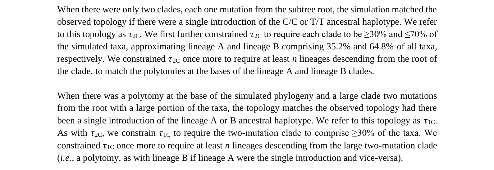

The derivation of the Bayes factors is described over pages 11 to 14 of the [Supplementary Materials](https://www.science.org/doi/suppl/10.1126/science.abp8337/suppl_file/science.abp8337_sm.v2.pdf). The approach is set out on page 11:


That is, the Bayes factors are the ratio of the likelihood of the sequence data $\bf{Y}$ arising from two introductions $I_2$ vs the likelihood of that sequence data $\bf{Y}$ arising from one introduction $I_1$:   

$$
BF = \frac{P(\mathbf{Y}|I_2)}{P(\mathbf{Y} |I_1)}
$$

Page 14 describes how the Bayes factor is taken from the combination of the posterior and prior odds:

$$
BF = \frac{P(I_2|\mathbf{Y})}{P(I_1|\mathbf{Y})} \cdot \frac{P(I_1)}{P(I_2)}
$$

Page 12 rewrites the posterior probabilities as joint probabilities and breaks them down in terms of the different MRCA haplotypes $S_{MRCA}$:

$$
BF = \frac{\sum_{S_{MRCA}} P(S_{MRCA} | Y)P(I_2, S_{MRCA})}{\sum_{S_{MRCA}} P(S_{MRCA} | Y)P(I_1, S_{MRCA})} \cdot \frac{P(I_1)}{P(I_2)}
$$

Page 13 breaks down the joint probabilities $P(I_2, S_{MRCA})$ and $P(I_1, S_{MRCA})$ over the possible topologies $\tau$:

$$
BF = \frac{\sum_{S_{MRCA}} \left( P(S_{MRCA} | Y)\left( \sum_{\tau} P(S_{MRCA} | \tau)P(\tau | I_2)P(I_2) \right) \right)}
{\sum_{S_{MRCA}}\left(  P(S_{MRCA} | Y)\left( \sum_{\tau} P(S_{MRCA} | \tau)P(\tau | I_1)P(I_1) \right) \right)} 
\cdot \frac{P(I_1)}{P(I_2)}
$$

Page 13 then describes the compatibility between the different topologies and MRCA haploytpes:


As noted in #7, the topology $(\tau_p, \tau_p)$ encompasses the sub-topologies $(\tau_p, \tau_{1c})$, $(\tau_{1c}, \tau_p)$ and $(\tau_{1c}, \tau_{1c})$. Therefore, it is sufficient to state:
- $\tau = \tau_{2c}$ is compatible with $S_{MRCA} \in \{S_{C/C}, S_{T/T}\}$
- $\tau = \tau_{1c}$ is compatible with $S_{MRCA} \in \{S_{A}, S_{B}\}$
- $\tau = (\tau_{P}, \tau_{P})$ is compatible with $S_{MRCA} \in \{S_{A}, S_{B}, S_{C/C}, S_{T/T}\}$

Page 13 then describes how the compatbility statements are used define $P(S_{MRCA}|\tau)$:


This description is wrong. The renormalization is applied to the vector of multiple MRCA haplotypes $(A, B, C/C, T/T)$ that are compatible with a topology. The renormalised vectors for the three relevant topologies are:
- $P(S_{MRCA}|\tau = \tau_{2c}) = (0, 0, 0.5, 0.5)$
- $P(S_{MRCA}|\tau = \tau_{1c}) = (0.5, 0.5, 0, 0)$
- $P(S_{MRCA}|\tau = (\tau_p,\tau_p)) = (0.25, 0.25, 0.25, 0.25)$

These allow the equation to be expanded out, with the priors $P(I_2)/P(I_1)$ being cancelled their inverse $P(I_1)/P(I_2)$:

$$
BF = 
\frac{0.25 \cdot P((\tau_P,\tau_P)|I_2) \cdot \left( P(S_A|Y) + P(S_B|Y) + P(S_{C/C}|Y) + P(S_{T/T}|Y) \right)} 
{ 0.5 \cdot P(\tau_{1c}|I_1) \cdot \left( P(S_A|Y) + P(S_B|Y) \right) + 0.5 \cdot P(\tau_{2c}|I_1)\cdot \left( P(S_{C/C}|Y) + P(S_{T/T}|Y) \right)}
$$

This is mathematically identical to the authors' equations, but simpler because it avoids the superfluous marginalization over the sub-topologies $(\tau_p, \tau_{1c})$, $(\tau_{1c}, \tau_p)$ and $(\tau_{1c}, \tau_{1c})$.

The authors inferred the posterior probabilities $P(S_A|Y)$, $P(S_B|Y)$, $P(S_{C/C}|Y)$ and P(S_{T/T}|Y) using the phylodynamic software [BEAST](https://beast.community/). Results from rooting the phylogenies at a putative common ancestor (recCA) and from not constraining the root (unconstrained) are shown in [Table 1](https://www.science.org/doi/10.1126/science.abp8337#T1). With these values, the equations become:

$$
BF_{unconstrained} = \frac{P((\tau_P,\tau_P)|I_2)} 
{ 1.76 \cdot P(\tau_{1c}|I_1) + 0.24 P(\tau_{2c}|I_1)},
\quad
BF_{recCA} = \frac{P((\tau_P,\tau_P)|I_2)} 
{ 1.72 \cdot P(\tau_{1c}|I_1) + 0.28 P(\tau_{2c}|I_1)}
$$

The authors measured the likelihoods $P(\tau_P|I_1)$, $P(\tau_{1c}|I_1)$ and $P(\tau_{2c}|I_1)$ from the frequencies with which successful simulated introductions produced the topologies $\tau_p$, $\tau_{1c}$ and $\tau_{2c}$. $P((\tau_P,\tau_P)|I_2)$ was then calculated as $P(\tau_P|I_1)^2$

 $\tau_p$ is defined on page 10:


Therefore, $P((\tau_p, \tau_p)|I_2)$ is the likelihood of two successful introductions producing two clades where there is a polytomy at the root of each clade.

$\tau_{1c}$ and  $\tau_{2c}$ are defined on page 11:



Therefore, $P(\tau_{1c}|I_1)$ and $P(\tau_{2c}|I_1)$ are the likelihoods of a single successful introduction producing two clades where there is a polytomy at the root of each clade, and
1. each clade includes 30-70% of the total taxa (taxa being sampled from the first 50,000 infections); and
2. the clades are separated by two mutations (with one being basal for $P(\tau_{1c}|I_1)$ and both being derived for $P(\tau_{2c}|I_1)$ ).

The additional conditions 1 and 2 reduce the single introduction likelihoods. This makes the published Bayes factors (4.2 and 4.3) meaningless, since they may be caused by this reduction rather than a higher plausiblity of the two introduction hypothesis.

This can be corrected by applying conditions 1 and 2 to the two introduction likelihood $P((\tau_P,\tau_P)|I_2)$.

This comment examines the effects of condition 1. A subsequent comment will examine condition 2.

Two simulations can be be tested against condition 1 by going through the first 50,000 infections amongst both, and comparing the number of samples from each, e.g.:
```
def test_sizes(run_1,run_2):
    # read samples into seperate sets for each run
    sample_dict = {run_1: set(), run_2: set()}
    # read transmissions into one list for both runs
    transmission_list = []
    for run in [run_1, run_2]:
        with open(f'simulations/{run:04d}/subsample_times.corrected.txt', 'r') as file:
            for line in file:
                u, t = line.strip().split('\t')
                sample_dict[run].add(u)
        with open(f'simulations/{run:04d}/transmission_network.subsampled.corrected.txt', 'r') as file:
            for line in file:
                u,v,t = line.strip().split()
                if u != v:
                    transmission_list.append((v,float(t),run))
    # sort the transmissions in order of time
    transmission_list = sorted(transmission_list, key=lambda x: x[1])
    # start sample counts from -1 because the primary case is not to be included 
    n_valid_samples = {run_1: -1, run_2: -1}
    # go through the first 50,000 transmissions and count those that are sampled from each run
    for event_no, transmission in enumerate(transmission_list):
        if event_no == 50000:
            break
        if transmission[0] in sample_dict[transmission[2]]:
            n_valid_samples[transmission[2]] += 1
    # compare the numbers of sampled transmissions to the relative size condition 
    if 0.3 <= n_valid_samples[run_1]/(n_valid_samples[run_1] + n_valid_samples[run_2]) <= 0.7:
        return True
    else:
        return False
```

The likelihood of two successful introductions producing basal polytomies and satisfying condition 1 can be measured by repeatedly drawing random pairs of simulations and testing them against both conditions, e.g.:
```
# sample 1100 topologies, as for the others
for i in range(1100):
    # draw two simulations
    run_1, run_2 = np.random.choice(range(1, 1101), 2, replace=True)
    # get the clade sizes
    clade_sizes_1 = clade_analyses_CC_d[run_1]['clade_sizes'] 
    clade_sizes_2 = clade_analyses_CC_d[run_2]['clade_sizes']
    # test them for basal polytomies
    if len(clade_sizes_1) >= min_polytomy_descendants and len(clade_sizes_2) >= min_polytomy_descendants: 
        # test their sizes
        if test_sizes(run_1, run_2):
            count_atLeastMinDescendants += 1
```

The function `clade_analysis_updated` in the notebook [stableCoalescence_cladeAnalysis.py](https://github.com/nizzaneela/multi-introduction/blob/corrected/FAVITES-COVID-Lite/scripts/stableCoalescence_cladeAnalysis.py) can be adapted to do this instead of counting the number of simulations with basal polytomies. The `function calculate_bf` can then be adapted to use the resulting likelihood as $P((\tau_p,\tau_p)|I_2)$. $(\tau_p,\tau_p)$ encompasses all topologies compatible with the two introduction hypothesis, so the likelihoods of the other two introduction topologies ( $(\tau_p,\tau_{1c})$, $(\tau_{1c},\tau_p)$, $(\tau_{1c},\tau_{1c})$ ), can be set to zero.
```
def calculate_bf(asr_results, simulation_results):
    # Let t_p be a polytomy, t_1C be one clade, and t_2c be two clades. Note that t_p includes t_1c. t_p equals all topologies with a basal polytomy (Fig. 2a). 
    # trees are in the order
    # (t_p, t_1C, t_2C, (t_p,(t_p,t_1C,t_2C)), (t_1C,(t_p,t_1C,t_2C)), (t_2c,(t_p,t_1C,t_2C)))
    ...
    pr_trees_given_I2 = np.concatenate([np.array([0]*3), np.array([simulation_results[0]]), np.array([0]*8)])
```

The notebook can then be rerun to produce the following results.


Removing the inconsistency in the relative size condition reduces the Bayes factors by a factor of six.

The paper measures the two week doubling times of the simulated epidemics at the 1000th infection, and found a 95% highest density interval (HDI) of 1.35 to 5.44 days. This range of early growth rates suggests that two introductions are unlikely to grow to similar sizes within the first 50,000 infections, and the results confirm this.

Code and instructions for reproducing these results are available at [this branch](https://github.com/nizzaneela/multi-introduction/tree/corrected_with_relative_size_condition) of the authors' repository.

#### Limitations
1. `test_sizes` assumes both introductions are simultaneous. This maximises the likelihood of the two introductions having similar sizes;
2. Each introduction has a different delay before the first samples due to the different times of first hospitalization. Realistically, the earlier time should apply to both. Therefore, this analysis misses some early samples in the simulation with the later time of first hospitalization. In some cases, missing these samples will drop branch counts below the polytomy threshold, or clade sizes below the relative size threshold, reducing the likelihood of a basal polytomy and satisfying condition 1;
3. Each introduction has a stable coalescence based on when it reaches 50,000 infections. Assuming the stable coalescence should instead be based on when simulations reach 50,000 combined infections, this analysis removes more basal lineages than it should, increasing the likelihood of basal polytomies.

Overall, the limitations increase the likelihood of two simulations satisfying conditions 1 and 2, so the resulting Bayes factors may be considered a rough upper bound.

It is theoretically possible that applying condition 3 to the two introduction likelihoods could increase the Bayes factors. This would require an increase in the likelihood of two introductions producing topologies compatible with the more probable MRCA haplotypes (i.e. A or B). This is considered unlikely, but will be confirmed either way in the next comment.
