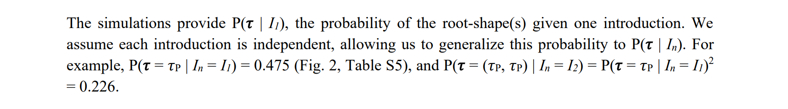

I’m afraid there is another bug in the notebook [cladeAnalysis.ipynb](https://github.com/sars-cov-2-origins/multi-introduction/blob/71ed420fe11ecdbe589568255ec90ca56d6e221c/notebooks/cladeAnalysis.ipynb). 

The function `calculate_bf` takes an array of values as `simulation_results` and divides them by their sum to produce `pr_3_topos` - an array of probabilities for three topologies:
```
def calculate_bf(asr_results, simulation_results):
...
# FAVITES simulation information
# the 3 trees are in the order (t_p, t_1C, t_2C)
pr_3_topos = np.array(simulation_results)/sum(simulation_results)
```
This would be an appropriate way to derive the probabilities for the three topologies, were the values the numbers of simulations conforming to the three topologies and their sum equal to the total number of simulations.

Unfortunately, the values are in fact the probabilities for the three topologies, already computed in `clade_analysis_update` (note that there were a total of 1100 simulations):
```
polytomy_result = count_atLeastMinDescendants/1100
…
cc_result = cc_count_30perc_twoPolytomies/1100
ab_result = ab_count_30perc_twoPolytomies/1100
…
simulation_results = [polytomy_result, ab_result, cc_result]
…
bf_unconstrained = calculate_bf(unconstrained_results, simulation_results)
bf_recCA = calculate_bf(recCA_results, simulation_results)
```
The sum of the values is the proportion of simulations that conform to one if the three topologies, which is generally significantly less than one. For example, for the main analysis prior to the bugfix in #1, the sum of the values (shown in Figure 2) was 0.475 + 0.005 + 0 = 0.48. Not that the arrangement of the topologies in Figure 2 differs from their order in the array:


By dividing these probabilities by their sum, `calculate_bf` increases them according to the proportion of simulations that do not have a topology in this subset. This increase is applied twice in the probabilities for the multiple introductions, because they are based on the single introduction probabilities squared. For example, in the main analysis the probabilities for the single introduction double from [0.475, 0.03, 0] to [0.94, 0.06, 0], while the most significant probability for the multiple introductions quadruples from [0.226] to [0.885]. The net result is doubling of the Bayes factors.

This is obviously wrong. The correct calculation, as described on page 13 of the supplementary materials, does not include this increase. 



This mistake might have been caused by miscommunication between the programmers of the different functions.
